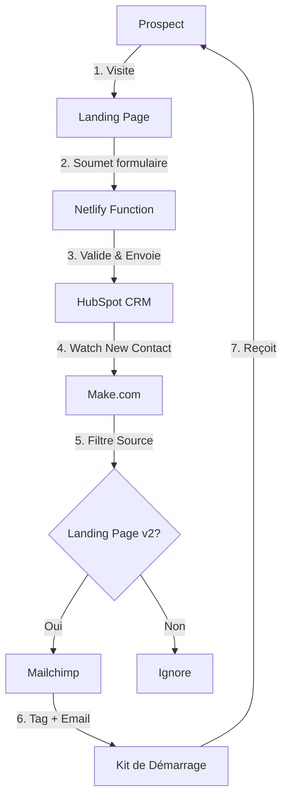

# 🚀 Système Automatisé de Génération de Leads - IA Pro Academy

[]() []() []()

> **Système clé en main pour capturer, qualifier et convertir automatiquement des leads qualifiés pour vos formations en Intelligence Artificielle.**

---

## 🎯 Objectif du Projet

Ce repository contient un **système complet et opérationnel** de génération de leads automatisé pour **IA Pro Academy**. Il intègre une landing page optimisée pour la conversion, un backend serverless sécurisé, et une automatisation complète via Make.com pour le nurturing des prospects.

### Résultats attendus:
- ✅ **50+ leads qualifiés** en semaine 1
- ✅ **Taux de conversion 15-25%** (visiteurs → leads)
- ✅ **Taux d'ouverture email 30-40%**
- ✅ **100% automatique** (zéro intervention manuelle)

---

## ⚡ Fonctionnalités Principales

### 🌐 Landing Page Conversion-Optimisée
- Design moderne avec TailwindCSS
- Formulaire d'opt-in avec validation RGPD
- Animations et micro-interactions
- Responsive (mobile-first)
- Call-to-action optimisé

### 🔒 Backend Sécurisé (Netlify Functions)
- Proxy API HubSpot sans exposition de clés
- Validation des données côté serveur
- Gestion des doublons
- Logs et monitoring

### 🤖 Automatisation Complète (Make.com)
- Détection automatique des nouveaux leads
- Filtrage intelligent par source
- Intégration Mailchimp pour nurturing
- Envoi automatique du kit de démarrage

### 📊 CRM & Tracking (HubSpot)
- Source unique de vérité (SSOT)
- Propriétés personnalisées
- Suivi du consentement RGPD
- Segmentation automatique

---

## 🛠️ Stack Technique

```
🌐 Frontend:      HTML5 + TailwindCSS + JavaScript Vanilla + Lucide Icons
⚙️ Backend:       Netlify Functions (Node.js Serverless)
📦 CRM:           HubSpot (API v3)
🔄 Automatisation: Make.com (Orchestration)
📧 Emailing:       Mailchimp (Nurturing + Kit)
```

---

## 🚀 Démarrage Rapide

### Prérequis
- Compte GitHub
- Compte Netlify (gratuit)
- Compte HubSpot (avec API key)
- Compte Make.com (gratuit)
- Compte Mailchimp (gratuit)

### Installation (5 minutes)

1. **Clone le repository**
```bash
git clone https://github.com/abblaye69/ia-pro-academy-lead-gen.git
cd ia-pro-academy-lead-gen
```

2. **Consulte le guide de déploiement**

Toutes les instructions détaillées sont dans:
📜 **[DEPLOYMENT.md](./DEPLOYMENT.md)** - Guide complet pas à pas

3. **Codes sources complets**

Tous les codes HTML, JS et Backend sont disponibles dans le document Flowith:
🔗 [Document Flowith](https://flowith.io/conv/f33b07d8-9c34-41a1-81a3-314954d5a5ed)

---

## 📊 Architecture du Système



---

## 📁 Structure du Projet

```
ia-pro-academy-lead-gen/
├── 📝 README.md              # Ce fichier
├── 🚀 DEPLOYMENT.md         # Guide de déploiement complet
├── 🌐 frontend/
│   ├── index.html           # Landing page
│   └── js/
│       └── main.js          # Logique formulaire
├── ⚙️ netlify/
│   └── functions/
│       └── submit-lead.js   # Proxy HubSpot sécurisé
├── 🔧 netlify.toml          # Config Netlify
└── 📦 package.json          # Dépendances Node
```

---

## ✅ Checklist de Déploiement

- [ ] Créer tous les fichiers dans GitHub
- [ ] Déployer sur Netlify
- [ ] Configurer la variable `HUBSPOT_ACCESS_TOKEN`
- [ ] Créer les propriétés HubSpot (`ia_academy_source`, `ia_academy_consent`)
- [ ] Configurer le scénario Make.com
- [ ] Créer le tag Mailchimp `LEAD_MAGNET_REQ`
- [ ] Tester le flux complet avec `test@yopmail.com`
- [ ] Lancer les premiers posts LinkedIn/TikTok

---

## 📚 Documentation

| Document | Description |
|----------|-------------|
| [DEPLOYMENT.md](./DEPLOYMENT.md) | Guide complet de déploiement pas à pas |
| [Document Flowith](https://flowith.io/conv/f33b07d8-9c34-41a1-81a3-314954d5a5ed) | Codes sources complets (HTML, JS, Functions) |

---

## 👥 Support & Contact

- **Projet**: IA Pro Academy
- **Organisation**: IA Calling
- **Région**: Lyon, France
- **Contact**: [contact@iacalling.com]

---

## 📦 Prochaines Évolutions

- [ ] A/B testing des variantes de landing page
- [ ] Intégration LinkedIn Ads pour le retargeting
- [ ] Dashboard analytics temps réel
- [ ] Séquence email avancée (7 jours)
- [ ] Chatbot IA pour qualification

---

## 🎉 Statut du Projet

**✅ PRÊT POUR PRODUCTION** - Version 3.0 (Make Edition)

Date de mise à jour: 10 Décembre 2025

---

**© 2025 IA Pro Academy | Tous droits réservés**
